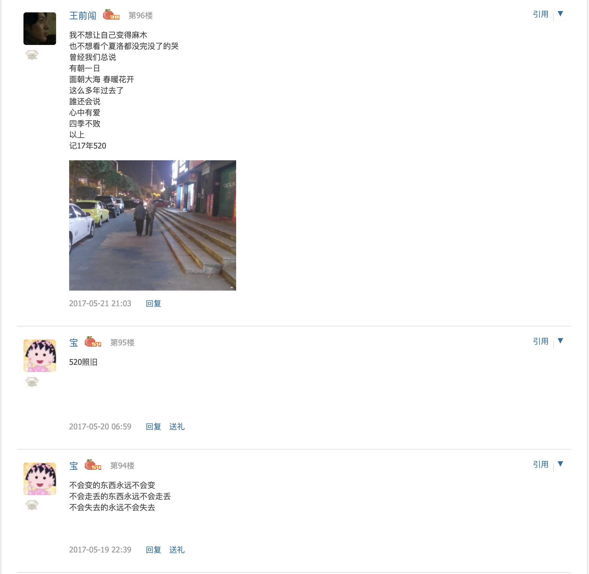
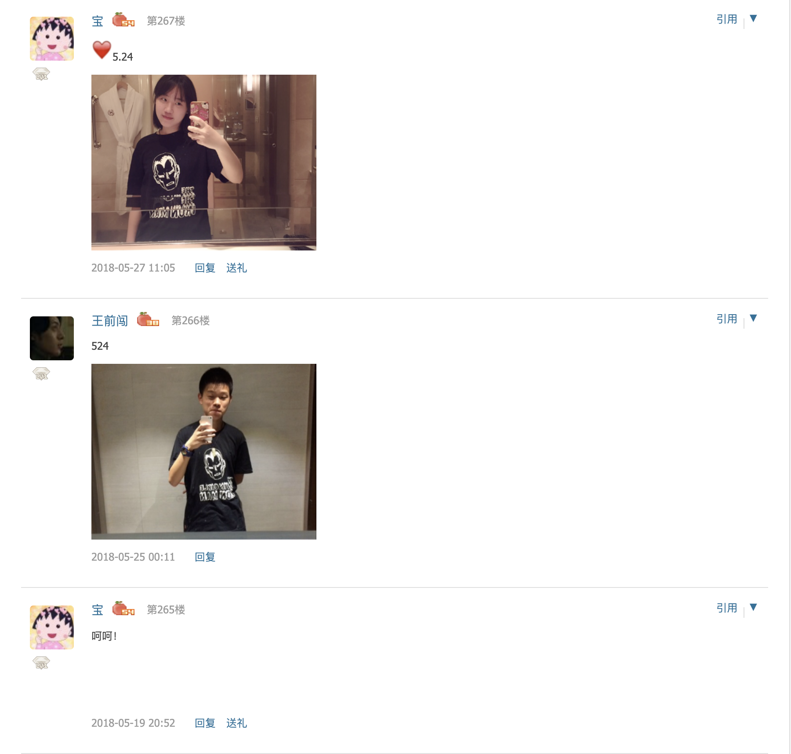
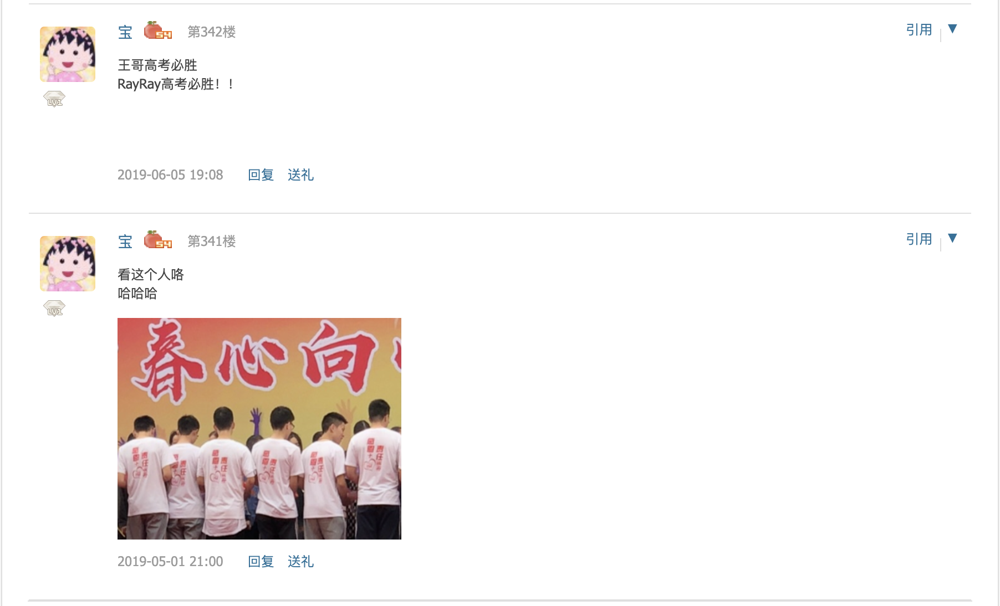
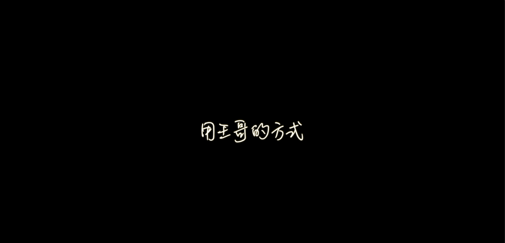

## To 睿:

**Hi ! 今天是我们认识的第 ```1358```天 也是我们第一个拥抱后的第```1169```天 也就是```28057```小时 ```1683420```秒**

**今天是第一次520 我不在你身边 也是第一次 有接近半年的时间不能在你身边<br>**

有时候我还会庆幸 幸好我们走过了这么长的时间 不然很可能会出问题<br>
但是有时候又一想 幸好你是这样的脾气 不然最后我们只会越走越孤单<br>
想着想着 我又想到了以前 想到了在高中的时光 想着才这么久 我的变化 你的变化<br>





**印象中的520 是伴随着争执和吵架的 不仅如此 还会伴随着一次又一次的延期和一封一封的信<br>**
**2019年6月8日 我们毕业了 伴随着最后一次从学校考试送你回家 我上了去郑州的车<br>之前在高考前不断念叨的8号晚上接你的活动也没有进行<br>**
我还记得高考前的无数个和你一起推车回去的晚上 带着一天的疲惫<br>总会和你聊聊毕业后的生活 做什么 怎么去玩 未来是什么样的<br>
当时想的很多的事 我一直都没有忘记 也正是因为如此 在现在的很多时候 想起这些 我会沮丧 会难过<br>

不仅仅是因为很多事情都没有完成 而是觉得自己现在在很多方面 比不上高三的自己.<br>
高三的王哥 你也了解 是一个很乐观 总是觉得未来很美好的人 并且总是会相信未来的人<br>
但是不知道是因为自己的高考没有达到预期 还是现在见到的事 经历的事<br>让我觉得自己离高中的目标越来越远 让我对自己的未来越来越不清楚<br>
高考前 我一直想改变世界 用自己的能力 改变自己的国家<br>让生活在这里的人民 不用做一些很低端的生产工作 可以像发达国家的人民一样 享受科技时代带来的便利<br>
但是到了现在 我总会觉得当时自己有点不切实际 我又会觉得自己最好能毕业之后进入一个好的IT公司 然后写一辈子的代码 能够给孩子好的教育 给父母好的晚年 给爱人幸福的生活 给周围人带来快乐
这就够了 我有点不知道 这是好还是不好 也许像我这样的人就是这样慢慢的从一个青年变成中年的吧 也许这就是长大的感觉吧<br>

最近 这种矛盾自责的感觉越来越强烈<br>不仅仅来自于自己的认知 还来自于外界的压力 这些都是在高中温室成长的我很多时候无法理解的<br>

**给我点时间好吗 给我点时间 我现在不够好 不能带给你什么 但是 我还是那个我<br>**
**很多时候 只有看见你我才会想起高中那个意气风发的自己 我才不会忘记自己的梦想是什么 自己所追随的是什么<br>**
**对不起宝 原谅我这么久的贱嘴巴和长的不能再长的头发 你也知道 这两者都是以前我最讨厌的<br>**
**最近 我都在想怎么让你不喜欢我 因为很多时候我觉得我已经没有以前的自信了<br>**
**或者说 没有以前那种一场考试考得很好就可以让我觉得又有能力陪伴着你的感觉了<br>**
**又或者说 现在不再是高中那个纯真的年代了 而我还一直想回去 想回到那个时候陪着你<br>**

我每天都想和你聊天 <br>我所有的笑都会给你 同时 所有自己无法忍受的负能量也会给你 对不起 宝

你是最了解王哥的 你知道我是什么样的人 你也知道我不会忘记所有的节日 无论是大到生日 还是小到多少天纪念日<br>
我当作忘记 不是因为我不喜欢你 而是因为我不喜欢给你过节的那个我 靠几句话就应付过这个节日 哪怕很准时哪怕很感人<br>
我也想在这么多个节日 这么多个分别的日子每天都能看到你 因为我做不到 所以我宁愿当作没有过

**其实 毕业一年 我想 很多事都没有变** <br>比如说每天最开心的事一直都是晚上和你做的事 只不过以前是晚上和你一起回去的时光 而现在是晚上能够和你视频的时光

比如说自己还是从没忘记自己的梦想 并且现在并不迷茫 也和高中一样<br>
对不起 宝 我很爱你 只是很多时候我的方式不对 很多时候我不想表达 很多时候我会不好意思向你表达

**如果你愿意 就等我回来 给你一个大大的惊喜<br>**
**如果你愿意 我们还是可以回到以前 在我们长大以后<br>**
**当然 如果你愿意 我还想让你继续当我的女朋友 虽然我现在发现自己确实挺糟糕的**
**但是我相信 还是和高中一样的相信 还是和高考出成绩时一样的相信 自己会达到想要的目标 就要那么理想主义的实现<br>**
**谢谢你 这么久一直陪着我 宝 祝你天天开心 祝妈妈赢钱 身体健康**

**好久没见了**

**希望你一切都好**

**不会让你失望的**



**-- 王哥 20200```520```**
